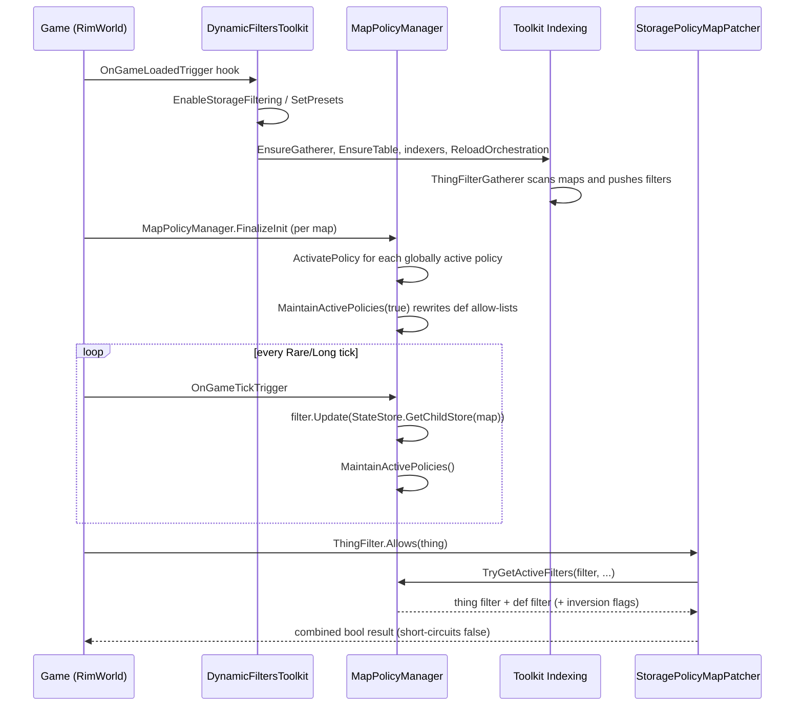

# Architecture Overview

Homebrewed Dynamic Filters (packageId `homebrewdot.net.rimworld.dynamicfilters`, mod class `HomebrewDot.Net.Rimworld.DynamicFiltersToolkit`) is a RimWorld 1.6 mod that lets players attach **dynamic filter policies** to the game's `Verse.ThingFilter` objects — the filters behind stockpiles, storage buildings, bills, outfits, food restrictions, pens, and wind turbines. A policy is a named, user-configurable rule ("filter all metallic stuff", "reject everything that rots", "select all defs from mod X") that is continuously applied to a chosen filter and can be combined with the vanilla filter.

The mod is built on the sibling **HomebrewDot.Net.Rimworld.Toolkit** assembly (an external dependency, see [Build and Deploy](build-and-deploy.md)) which supplies the data-indexing pipeline, condition/collector engines, services, and hook (event) system. This repository contains the mod logic only; the Toolkit is referenced as a compiled DLL.

## Repository layout

| Path | Purpose |
|---|---|
| `src/HomebrewDot.Net.RimWorld.DynamicFilters/` | The mod class library (assembly `HomebrewDot.Net.Rimworld.DynamicFilters`) |
| `Defs/MainButtonDefs/PoliciesButton.xml` | Def for the optional Policies toolbar button (`HomebrewDot_Policies`) |
| `About/About.xml` | Mod metadata: name, author, packageId, supported version 1.6, dependencies (Core, Harmony, Homebrewed Toolkit), `loadAfter` falconne.BWM |
| `1.6/Assemblies/` | Prebuilt DLL + PDB checked into the repo (build output path) |
| `tests/Unit/` and `tests/Integration/` | xUnit test projects (net472) |
| `.github/workflows/openwiki-update.yml` | Scheduled workflow that refreshes this wiki |

## Key subsystems

- **[Mod entry point and static registries](../mod/entrypoint.md)** — `DynamicFiltersToolkit : Mod` owns lifecycle hooks, the `Templates` registry (available policy templates), the `Policies` registry (active policy providers), and the `Indexing.ThingFilter` table wiring.
- **[Filtering abstractions](../filtering/concepts.md)** — `IDynamicPolicy<TScope,TItem>`, `IDynamicFilter<TScope,TItem>`, `ICollectionPolicy`, `IDynamicPolicyProvider` and the `ActivatedPolicies` activation context.
- **[MapPolicyManager](../filtering/map-policy-manager.md)** — per-`Map` runtime component that instantiates, updates, and persists the association between `ThingFilter` objects and active policies.
- **[ThingFilterGatherer](../filtering/thing-filter-gatherer.md)** — pushes every relevant `ThingFilter` into the Toolkit indexing snapshot so filters can be looked up by storage and map.
- **[Policies](../policies/simple-filter-policy.md) and [presets](../presets/overview.md)** — template-driven user policies (`SimpleFilterPolicy`, `ComplexFilterPolicy`) plus read-only preset policies (e.g. `BlocksWindmillPolicy`) and the built-in preset catalog.
- **[StoragePolicyMapPatcher](../storage/storage-policy-map-patcher.md)** — Harmony prefixes on `ThingFilter.Allows(Thing)` and `ThingFilterUI.DoThingFilterConfigWindow` that enforce policies at runtime and render the policy bars.
- **[Better Workbench Management integration](../integration/better-workbench-management.md)** — soft, reflection-based integration with the falconne.BWM "Count Additional" per-bill output filter.
- **[Settings UI](../ui/settings.md)** — a tabbed settings dialog (Settings / Templates / Policies) plus the optional Policies toolbar button.

## End-to-end runtime flow

The diagram below shows the core runtime loop once storage filtering is enabled. All participants are grounded in source: `DynamicFiltersToolkit.ConfigureServices()` registers the `OnGameLoadedTrigger` hook; `EnableStorageFiltering()` wires gatherer/table/indexers and applies Harmony patches; `MapPolicyManager.FinalizeInit()` activates globally-active policies per map; the `OnGameTickTrigger` hook updates filters; and `StoragePolicyMapPatcher.Prefix_ThingFilter_Allows` enforces policies on every `ThingFilter.Allows(Thing)` call.

Caption: Runtime enforcement loop from game load through per-tick filter maintenance and per-call filter evaluation.

## Dependency boundary with the Toolkit

The Toolkit (referenced DLL `HomebrewDot.Net.Rimworld.Toolkit`, not in this repo) provides, at minimum, the following surfaces this mod relies on:

- `Toolkit.Indexing` — schema (`ConfigureSchema`), snapshot orchestrator (`ConfigureOrchestrator`, `ReloadOrchestration`, `StartIndexing`), `Manager`/`DatabaseSnapshot`/`Database`, tables, `Indexers.BuildIndexer`, metadata (`IndexMetadata`, `IndexMetadataKey<T>`), `IDataGatherer`/`ISnapshotManager`.
- `Toolkit.Collecting` — `Build`, `Remove`, `GetAllCollectors`, `ICollector<T>`, `SnapshotCollector<T>`, collection condition builders.
- `Toolkit.Comparing` — `ConditionBuilder`, `ConditionDef`/`ConditionDefConfig`, `Comparator`, reference types (`IndexedReferenceType`, `PropertyReferenceType`, `ValueReferenceType`, `StatReferenceType`, `CompReferenceType`, `SelfReferenceType`) and operator types (Equals, NotEquals, Greater, GreaterOrEqual, Lesser, LesserOrEqual, True, False, Null, NotNull, Match, In, Contains, InThingCategory).
- `Toolkit.Services` — named service registration/lookup (`Register`, `Get`, `GetAllNamed`).
- `Toolkit.Hooks` — `Hooks.Manager.RegisterHook/Trigger`, hook trigger types such as `OnGameLoadedTrigger`, `OnGameTickTrigger`, `Changed`, and `HomebrewDot.Net.Rimworld.Hooks.Triggers`.
- `Toolkit.Helpers` — `Guard`, `Invoking.Safe`, `Logging`, `Expression.GetMember`.
- `ToolkitConstants` — metadata names (`Thing.Map`, `Thing.ModId`, `Thing.HitPointPercentage`, `Def.Thing.IsConstructionMaterial`, `Def.Thing.IsFoul`, `Def.Thing.IsDrink`, `Def.Thing.IsAlcoholic`, `Def.Thing.IsMedical`, `Def.Thing.IsSurgical`, `Thing.IsUnique`) and mod-loaded flags (`ToolkitConstants.Mods.*`, `ToolkitConstants.Odyssey`).

The mod's own metadata keys are defined in `DynamicFiltersToolkitConstants` (`ThingFilter.StorageIdKey` = `DynamicFilters.StorageId`, `ThingFilter.StorageKey` = `DynamicFilters.Storage`).

## Scope boundaries

- This mod **enables** `ThingFilter` management only when `Settings.EnableStorageFiltering` is true; policy templates are registered regardless, but presets only activate when `Settings.EnablePresets` is true.
- `StoragePolicyThingMapFilter` (in `Storage/Models/`) is an unimplemented `SpecialThingFilterWorker` stub whose `Matches` throws `NotImplementedException`; it is not wired into any runtime path.
- The mod targets RimWorld 1.6 only (`About.xml`), Harmony 1.5 (`0Harmony.dll`).
