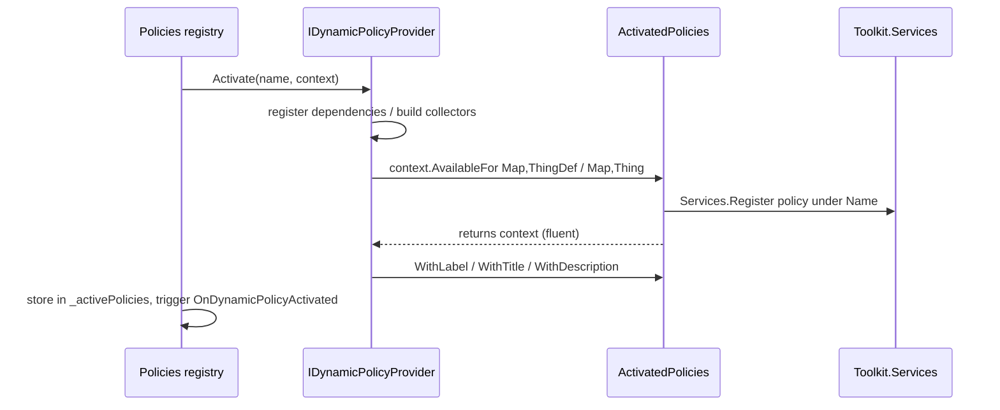

# Filtering Concepts

The filtering model has three layers: a **provider** (created from a template/settings) that exposes one or more **policies**; a **policy** (`IDynamicPolicy<TScope,TItem>`) that, given a scope (a `Map`), produces an **filter** (`IDynamicFilter<TScope,TItem>`) which decides whether an item passes; and a **runtime manager** ([MapPolicyManager](map-policy-manager.md)) that stores those filters per map and applies them to `ThingFilter` objects. All interfaces live under `Filtering/` in namespace `HomebrewDot.Net.Rimworld.Filtering`.

## `IDynamicPolicy<TScope, TItem>`

```csharp
public interface IDynamicPolicy<TScope, in TItem> where TScope : class
{
    string Name { get; }
    IDynamicFilter<TScope, TItem> GetFilter(TScope scope);
}
```

A named rule that produces a scope-bound filter. In this mod `TScope` is always `Verse.Map` and `TItem` is either `Verse.Thing` (instance-level filtering) or `Verse.ThingDef` (def-level filtering).

## `IDynamicFilter<TScope, TItem>`

```csharp
public interface IDynamicFilter<TScope, in TItem> where TScope : class
{
    TScope Scope { get; }
    IDynamicPolicy<TScope, TItem> Policy { get; }
    bool Filter(TItem item);
    bool Update(IStateStore<TScope> stateStore);
}
```

- `Filter(item)` — evaluates one item against the filter.
- `Update(stateStore)` — called periodically by `MapPolicyManager` (tick hook) and on activation; returns `true` when the filter's internal state changed (so callers know to rewrite allow-lists). See [State Store](../state/state-store.md).

## `ICollectionPolicy<TScope, TItem>`

A policy backed by Toolkit `ICollector<TItem>`s: `Collection` is the primary allow-set; `FallbackCollections` (ordered) are used when the primary collection is empty. The mod's concrete implementation is [CollectionPolicy](../policies/collection-policy.md).

## `IDynamicPolicyProvider` and the activation context

```csharp
public interface IDynamicPolicyProvider
{
    void Activate(string name, IDynamicPolicyProviderActivationContext context);
    void Deactivate(Action disposePolicies);
}

public interface IDynamicPolicyProviderActivationContext
{
    IDynamicPolicyProviderActivationContext AvailableFor<TScope, TItem>(IDynamicPolicy<TScope, TItem> policy) where TScope : class;
    IDynamicPolicyProviderActivationContext WithLabel(string label);
    IDynamicPolicyProviderActivationContext WithTitle(string title);
    IDynamicPolicyProviderActivationContext WithDescription(string description);
}
```

Activation flow (orchestrated by `DynamicFiltersToolkit.Policies.TryActivateProvider`, see [Mod Entry Point](../mod/entrypoint.md)):



Caption: Policy provider activation registers each policy with `Toolkit.Services` under the policy name so `MapPolicyManager` can look it up per map.

## `ActivatedPolicies`

`ActivatedPolicies` (`Filtering/Models/ActivatedPolicies.cs`) is the concrete `IDynamicPolicyProviderActivationContext` and also the record shown in the UI:

- Properties: `Name` (unique), `Label`/`Title`/`Description` (default to provider type name / type name / empty, overridable through the fluent methods), `Provider`, `IsReadOnly` (true for code-provided presets, hides edit/rename in the UI).
- `AvailableFor<TScope,TItem>` registers the policy via `Toolkit.Services.Register<IDynamicPolicy<TScope,TItem>>(policy, Name)` and chains an unregister-by-name on dispose; `Dispose()` runs all queued dispose actions inside `Invoking.Safe`.
- It is created by `TryActivateProvider` and disposed by `DeactivateProvider` exactly once.

## Triggers

`Filtering/Triggers/DynamicPolicyTriggers.cs` defines `OnDynamicPolicyActivated` and `OnDynamicPolicyDeactivated`, each carrying the policy `Name`. `MapPolicyManager` implements `IHook<OnDynamicPolicyActivated>`/`IHook<OnDynamicPolicyDeactivated>` (priority `byte.MinValue`, i.e. late) to create/destroy the per-map filters for that policy name; see [Map Policy Manager](map-policy-manager.md).

## Relationship to the Toolkit services

Policies are looked up by name at activation time: `MapPolicyManager.ActivatePolicy(name)` calls `Toolkit.Services.Get<IDynamicPolicy<Map, Thing>>(name)` and `Toolkit.Services.Get<IDynamicPolicy<Map, ThingDef>>(name)`. Both may exist for the same name (e.g. `CollectionPolicy` implements both), in which case the map gets both a thing-level and a def-level filter.

## Related pages

- [Delegate Filtering Components](delegate-components.md) — delegate-based implementations.
- [Map Policy Manager](map-policy-manager.md) — where filters live at runtime.
- [Collection Policy](../policies/collection-policy.md) — the concrete policy used by the filter templates.
