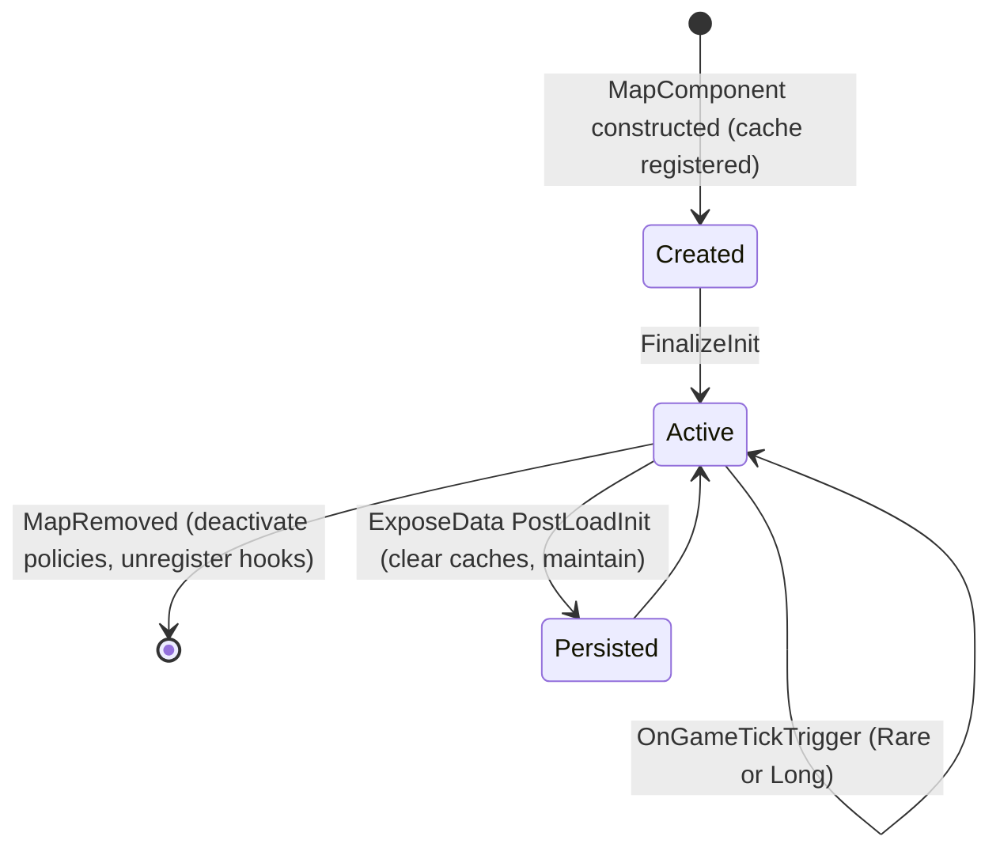

# Map Policy Manager — `MapPolicyManager`

`MapPolicyManager` (`Filtering/Components/MapPolicyManager.cs`) is a `Verse.MapComponent` plus `IHook<OnDynamicPolicyActivated>`, `IHook<OnDynamicPolicyDeactivated>`, `IHook<OnGameTickTrigger>`, and `IExposable`. It is the runtime heart of the mod: one instance per `Map`, holding the active thing/def filters and the map of which `ThingFilter` belongs to which policy.

## Instance cache

`MapPolicyManager.GetFor(Map)` uses a static `Dictionary<Map, MapPolicyManager> _instances` to avoid `Map.GetComponent<T>`'s O(n) scan. The constructor registers the instance (`_instances.Remove(map)` then `Add`); `MapRemoved()` removes it. `StoragePolicyMapPatcher` and `BetterWorkbenchManagementSupport.Prefix_CountProducts` use `GetFor(map)` to resolve the manager during `ThingFilter.Allows` and BWM counting (see [Storage Policy Map Patcher](../storage/storage-policy-map-patcher.md)).

## State held per map

- `_thingFilters` / `_defFilters`: `Dictionary<string, IDynamicFilter<Map, Thing>>` / `<Map, ThingDef>` — active filters keyed by policy name.
- `_storageToThingFilterMap` / `_storageToDefFilterMap`: storageId → policyName for the (non-inverted) assignment.
- `_storageToInvertedThingFilterMap` / `_storageToInvertedDefFilterMap`: storageId → policyName for inverted assignments (policy + reject/deselect semantics).
- `_filterToThingCache` / `_filterToDefCache`: `ThingFilter` → policyName lookup caches.
- `_filterCache`: `ThingFilter` → `(Thing filter, ThingInverted, Def filter, DefInverted)` — combined lookup cache, cleared whenever the association changes or a policy activates/deactivates.

The storageId strings come from the index metadata `DynamicFiltersToolkitConstants.ThingFilter.StorageIdKey` written by the [ThingFilterGatherer](thing-filter-gatherer.md) (e.g. a zone's `GetUniqueLoadID()`, a building's, a storage group's, `"{bill}_Animals"`, `"{bill}_AutoCut"`, `"{bill}_ProductAdditional"`).

## Managing a filter with a policy

`ManageWith(ThingFilter filter, string policyName, bool isForThing, bool inverted)` is the entry point used by the policy bar UI (and effectively by activation):

1. Rejects when the policy is not active on this map or the filter is not indexed / lacks a storageId.
2. Records the (inverted) assignment in the appropriate storage→policy map, removing any previous inverted entry for the storage.
3. If the storage is already managed by a **different** policy, logs and `Unmanage`s it first (one policy per filter per side).
4. Writes `_filterToXCache`, clears `_filterCache`, and for def filters calls `MaintainActivePolicies(true)` so the allow-list is rewritten immediately.

`Unmanage(filter, isForThing)` removes the association and caches; `CouldManage(filter)` answers "is this filter indexable and are there active policies at all" (used by the UI prefix). `TryGetManagedPolicyName(filter, isForThing, out policyName)` resolves the managing policy via caches then the storage maps.

Lookups used at enforcement time (via the combined `TryGetActiveFilters`):

- `TryGetDefFilter(policyName, out filter)` / `TryGetThingFilter(policyName, out filter)` — by policy name.
- `TryGetActiveDefFilter(ThingFilter, out filter)` / `TryGetActiveThingFilter(ThingFilter, out filter)` — by filter instance, through storageId.
- `TryGetActiveFilters(ThingFilter, out thing, out thingInverted, out def, out defInverted)` (internal) — single combined lookup that fills `_filterCache`; this is what the `ThingFilter.Allows` prefix calls.

## Lifecycle

Caption: MapPolicyManager lifecycle: created with the map, activated in `FinalizeInit`, kept fresh by hooks/ticks, persisted across save/load, torn down on `MapRemoved`.

- `FinalizeInit()`: for every globally active policy (`DynamicFiltersToolkit.Policies.ActivePolicies`) calls `ActivatePolicy(name)`; then registers itself for the activation/deactivation hooks.
- `ActivatePolicy(name)`: looks up `Toolkit.Services.Get<IDynamicPolicy<Map, Thing>>(name)` and `<Map, ThingDef>(name)`; for each present, `GetFilter(map)` inside `Invoking.Safe` and stores it; finally `MaintainActivePolicies(true)`.
- `DeactivatePolicy(name)`: removes filters and disposes any `IDisposable` filter.
- `MapRemoved()`: deactivates all active policies for the map and unregisters its hooks.
- Tick hook `OnGameTickTrigger`: only acts when `arg.TickerType` equals `TickerType.Rare` (default) or `TickerType.Long` when `Toolkit.Settings.SlowGatheringEnabled` is set; updates every thing filter via `filter.Update(StateStore.GetChildStore(map))` then `MaintainActivePolicies()`.

## MaintainActivePolicies

`MaintainActivePolicies(bool force = false)` is the def-allow-list writer. It iterates the def-managed filters (`_filterToDefCache.Keys`):

- Drops filters no longer indexed (and clears their caches).
- Calls `defFilter.Update(StateStore.GetChildStore(map))` (safe-wrapped); when the update reported a change **or** `force` is true, re-evaluates every `ThingDef` in `DefDatabase<ThingDef>.AllDefsListForReading` through `defFilter.Filter(def)` and applies `filter.SetAllow(def, isAllowed)` (with inversion). The loop is timed; `IsPerformanceEnabled` logs the elapsed ms (instrumented in commit `11c1bae`).

Note that thing-level policies do not need allow-list maintenance: they are enforced lazily in `ThingFilter.Allows` through the prefix (see [Storage Policy Map Patcher](../storage/storage-policy-map-patcher.md)).

## Save/load persistence

`ExposeData()` scrubs the four storage→policy dictionaries under the node names `filterToPolicyMap`, `filterToThingPolicyMap`, `filterToInvertedPolicyMap`, `filterToInvertedThingPolicyMap`. On `LoadSaveMode.PostLoadInit` it clears all three caches and calls `MaintainActivePolicies(true)` to rebuild the def allow-lists. The integration test `ThingFilterMapPersistenceTests` verifies the metadata side of this flow (see [Integration Tests](../testing/integration-tests.md)).

## Related pages

- [Filtering Concepts](concepts.md) — the abstractions managed here.
- [ThingFilterGatherer](thing-filter-gatherer.md) — who writes the storageId metadata.
- [Storage Policy Map Patcher](../storage/storage-policy-map-patcher.md) — the enforcement-time consumer.
- [State Store](../state/state-store.md) — the `StateStore<Map>.Root.GetChildStore(map)` pattern.
