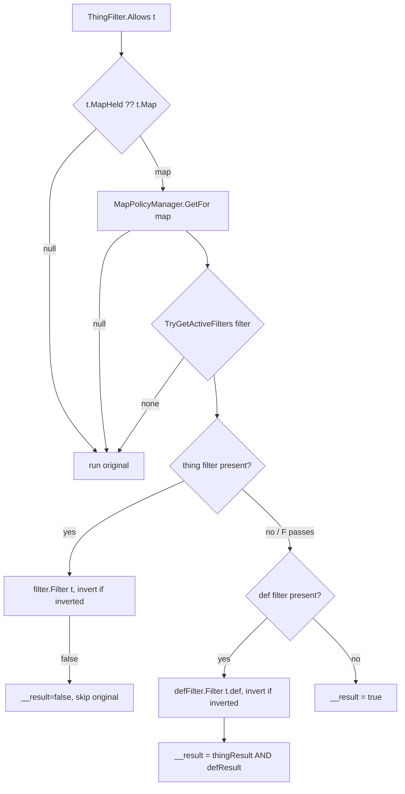

# Storage Policy Map Patcher — `StoragePolicyMapPatcher`

`StoragePolicyMapPatcher` (`Storage/Models/StoragePolicyMapPatcher.cs`, namespace `HomebrewDot.Net.Rimworld.Storage.Models`) is the enforcement seam of the mod. It is a static class of Harmony patches applied by `EnableStorageFiltering()` and removed by `DisableStorageFiltering()` (see [Mod Entry Point](../mod/entrypoint.md)). It never owns policy state itself — every lookup goes through the per-map [MapPolicyManager](../filtering/map-policy-manager.md).

## Patch surface

`ApplyPatches()` / `RemovePatches()` toggle two prefixes on `DynamicFiltersToolkit.Harmony`:

| Patched method | Prefix | Purpose |
|---|---|---|
| `ThingFilter.Allows(Thing)` | `Prefix_ThingFilter_Allows` | enforce active policies on every per-item filter check |
| `ThingFilterUI.DoThingFilterConfigWindow(Rect, ThingFilter, Map)` | `Prefix_ThingFilterUI_DoThingFilterConfigWindow` | draw the policy bars and shrink the original UI rect |

## `Prefix_ThingFilter_Allows` — enforcement

Semantics:

1. Resolves the map from `t.MapHeld ?? t.Map`; without a map (or a manager for it) the original filter runs unchanged.
2. `MapPolicyManager.TryGetActiveFilters(filter, out thing, out thingInverted, out def, out defInverted)` returns the combined active filters for the filter's storageId (see [Map Policy Manager](../filtering/map-policy-manager.md)).
3. Thing filter evaluated first with its inversion flag; a rejected thing short-circuits to `false` and skips the original.
4. Def filter (evaluated on `t.def`) is ANDed with the thing result; the prefix then returns `__result` — false skips the original, true lets the vanilla filter run.

`StoragePolicyThingMapFilter` (`Storage/Models/StoragePolicyThingMapFilter.cs`) is an unused `SpecialThingFilterWorker` stub whose `Matches` throws `NotImplementedException`; it is not wired into any runtime path.

## `Prefix_ThingFilterUI_DoThingFilterConfigWindow` — policy bars

Runs only when the map resolves (via `ResolveMap(filter)`, which looks the filter up in the indexed `ThingFilter` table and reads its `Map` metadata — see [ThingFilterGatherer](../filtering/thing-filter-gatherer.md)) and the manager `CouldManage(filter)`:

- Resolves the active thing/def policy name sets; `BetterWorkbenchManagementSupport.IsDefOnlyFilter(filter)` hides the thing bar for BWM "Count Additional" filters (see [BWM integration](../integration/better-workbench-management.md)).
- Draws up to two bars, each with: a left **invert checkbox** (`Widgets.Checkbox`), a label `"Allow: {policy}"` / `"Reject: {policy}"` for thing policies and `"Select: {policy}"` / `"Deselect: {policy}"` for def policies, and a FloatMenu with `None` plus every active policy name.
- Selecting a policy calls `manager.ManageWith(filter, policyName, isForThing, inverted)`; `None` calls `manager.Unmanage(filter, isForThing)`; toggling the checkbox re-manages with `!inverted`.
- Long labels are truncated with a `"..."` suffix (binary-search for the fit) and show a tooltip with the full label.
- The `rect` is shrunk downward by the total bar height (`PolicyBarHeight` 28 + gaps) so the vanilla config window renders below the bars.

## Related pages

- [Mod Entry Point](../mod/entrypoint.md) — activation order.
- [Map Policy Manager](../filtering/map-policy-manager.md) — `TryGetActiveFilters`, `ManageWith`, `Unmanage`, `CouldManage`.
- [Thing Filter Gatherer](../filtering/thing-filter-gatherer.md) — `ResolveMap`'s indexed metadata.
- [Integration Tests](../testing/integration-tests.md) — enforcement is exercised end-to-end there.
